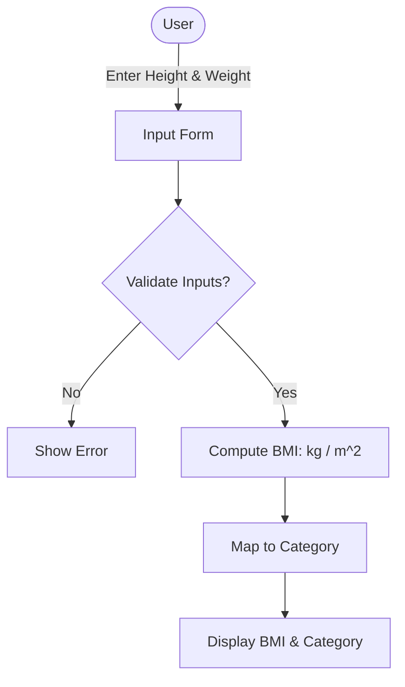

```mermaid
flowchart TD
User([User]) -->|Enter Height & Weight| Input[Input Form]
Input --> Validation{Validate Inputs?}
Validation -- No --> Error[Show Error]
Validation -- Yes --> Calc[Compute BMI: kg / m^2]
Calc --> Category[Map to Category]
Category --> Result[Display BMI & Category]
```
