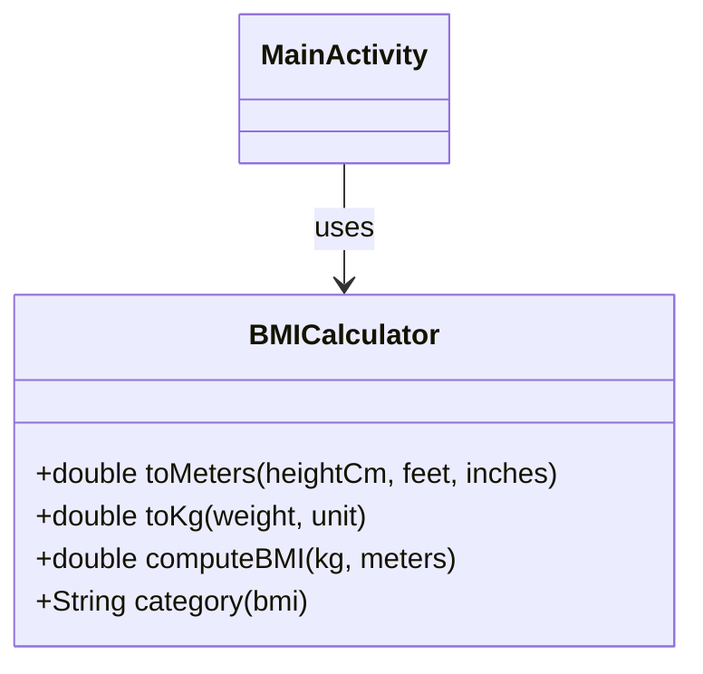

```mermaid
classDiagram
class BMICalculator {
  +double toMeters(heightCm, feet, inches)
  +double toKg(weight, unit)
  +double computeBMI(kg, meters)
  +String category(bmi)
}
class MainActivity
MainActivity --> BMICalculator : uses
```
